<link rel="stylesheet" href="style.css">

# COMP 576 Assignment 2
**Lingyi Xu (lx28@rice.edu)**
**Nov 5th, 2024**


## 1. Visualizing a CNN with CIFAR10

<!-- ### 1. a) CIFAR10 Dataset

In this implementation, we use PyTorch’s built-in data loading and preprocessing functions instead of using the `trainCifarStarterCode.py` script and manually downloaded dataset files. This approach uses PyTorch's `torchvision.datasets.CIFAR10` (as provided in the skeleton) to directly download and load the CIFAR-10 dataset, applying necessary transformations such as converting images to grayscale, scaling pixel values by dividing by 255 (through normalization), and standardizing with a mean of 0.5 and standard deviation of 0.5. This approach ensures efficient loading and preprocessing, maintaining consistency with the instructions without the need for manual dataset management.

Additionally, the labels were not manually one-hot encoded as PyTorch's CrossEntropyLoss handles categorical labels directly. This setup simplifies the data preparation pipeline while adhering to the preprocessing requirements for grayscale conversion and normalization. -->

### 1. b) Train LeNet5 on CIFAR10

Initially, I used a learning rate of 0.001 and the Adam optimizer as default settings. Here are the train/test accuracy and train loss plots generated:
<div style="display: flex; justify-content: space-around;">
    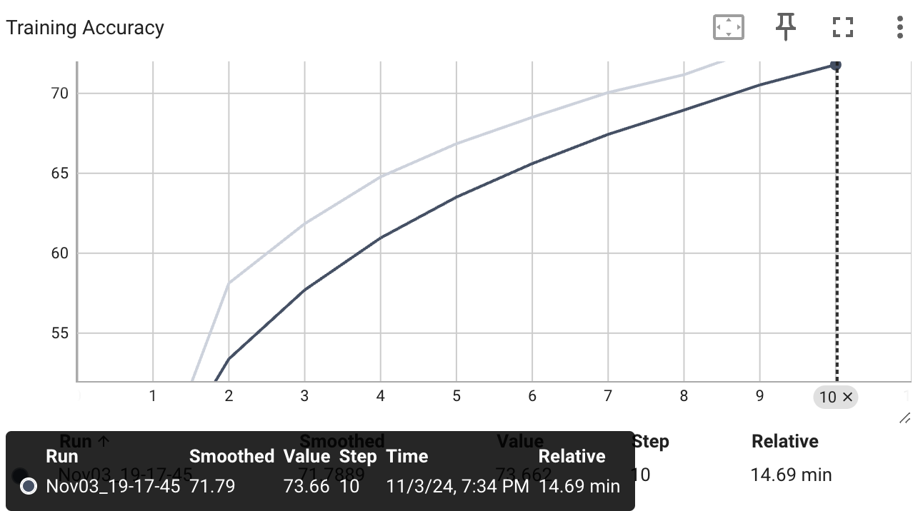
    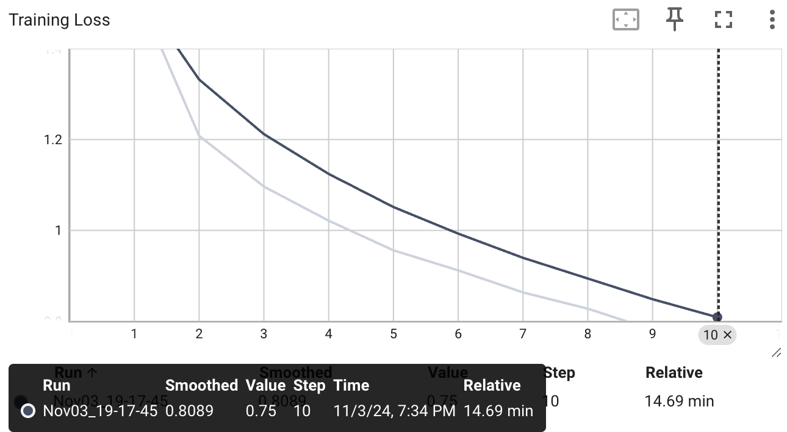
</div>
<div style="display: flex; justify-content: space-around;">
    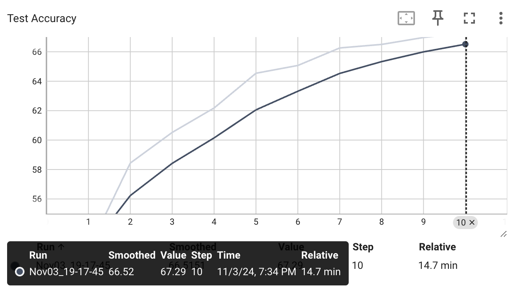
    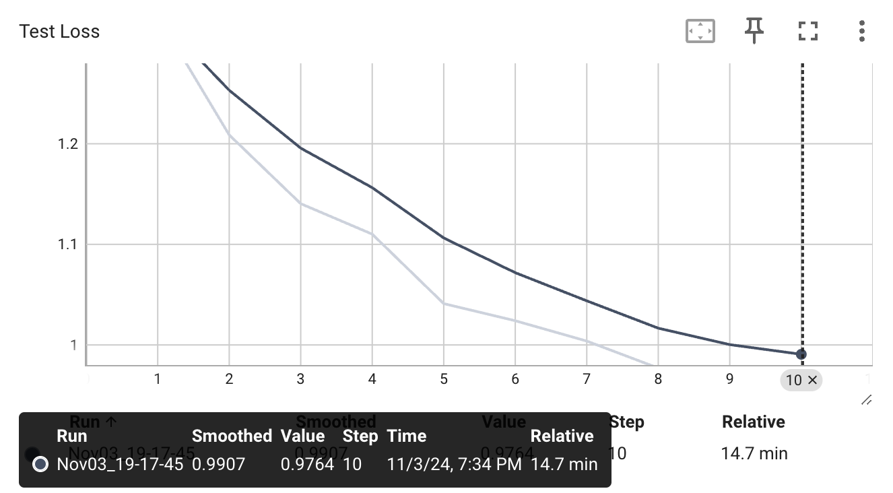
</div>

The results obtained are as follows:
- Test Accuracy = 67.29
- Test Loss = 0.9764
- Training Accuracy = 73.662
- Training Loss = 0.75

Next, with epochs = 5, different optimizers, learning rates, and momentum values are experimented. The results for train/test accuracy and train loss across various configurations are summarized in the table below:

| No. | Optimizer | Learning Rate | Momentum | Test Accuracy | Test Loss | Training Accuracy | Training Loss |
| --- | --------- | ------------- | -------- | ------------- | --------- | ----------------- | ------------- |
| 1   | Adam      | 0.001         | -        | 64.54         | 1.0411    | 66.85             | 0.9561        |
| 2   | SGD       | 0.001         | -        | 23.93         | 2.1566    | 22.886            | 2.1791        |
| 3   | Adam      | 0.01          | -        | 16.15         | 2.4999    | 16.15             | 2.6682        |
| 4   | Adam      | 0.005         | -        | 10.00         | 2.3034    | 10.08             | 2.3037        |
| 5   | SGD       | 0.01          | -        | 44.98         | 1.5635    | 43.63             | 1.5963        |
| 6   | SGD       | 0.005         | -        | 37.04         | 1.8221    | 35.19             | 1.8672        |
| 7   | SGD       | 0.001         | 0.8      | 36.98         | 1.8251    | 35.11             | 1.8694        |
| 8   | SGD       | 0.001         | 0.5      | 28.09         | 2.0514    | 27.22             | 2.0659        |

Summary: Using the **Adam** optimizer with a **learning rate of 0.001** provided the best overall model performance. This configuration achieved a balanced performance in terms of both training and test accuracy as well as loss, making it an ideal choice for the model.

### 1. c) Visualize the Trained Network
Using a learning rate of 0.001, 10 epochs, and the Adam optimizer, the visualization of the first convolutional layer’s weights is shown below:
<p align="center">
    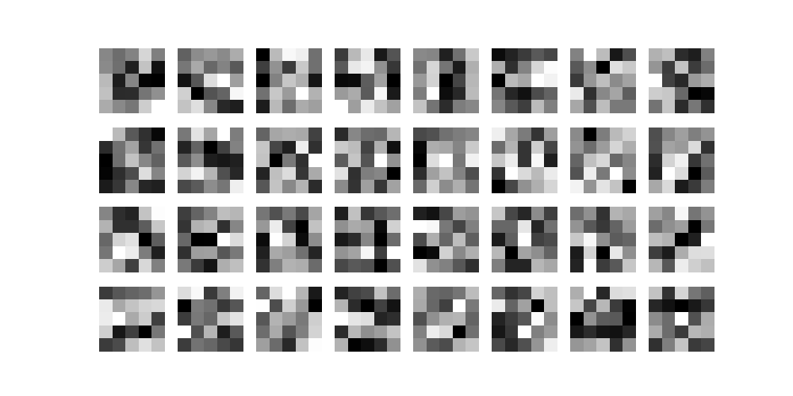
</p>

The statistics of the activations in the convolutional layers on test images are as follows:
```
Activation mean: -0.07476064562797546, variance: 0.03350016847252846
```
The mean value is close to 0, which indicates that the activations in the convolutional layer are relatively balanced. This distribution is typical and beneficial as it helps prevent gradient vanishing or exploding during training. The variance of 0.0335 indicates that the activations are spread within a narrow range, suggesting that the layer's responses to inputs have stabilized after training.

### 2. Visualizing and Understanding Convolutional Networks


## 3. Build and Train an RNN on MNIST

### 3. a) Setup an RNN

plot one example: 
<p align="center">
    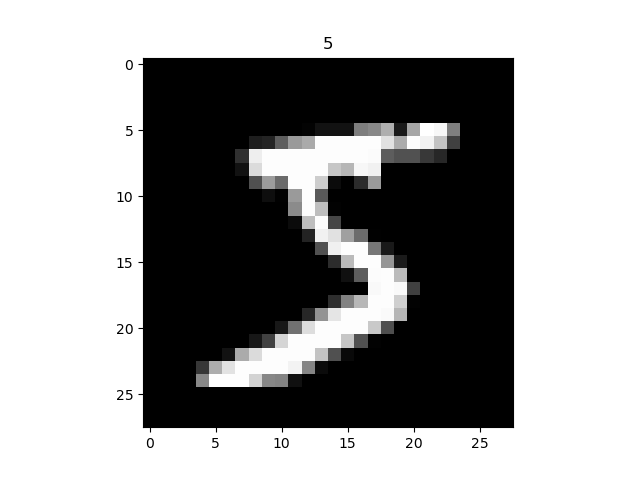
</p>

To get better results, the learning rate is set to `lr = 0.001`. Below are the training/test accuracy and training loss plots generated:
<div style="display: flex; justify-content: space-around;">
    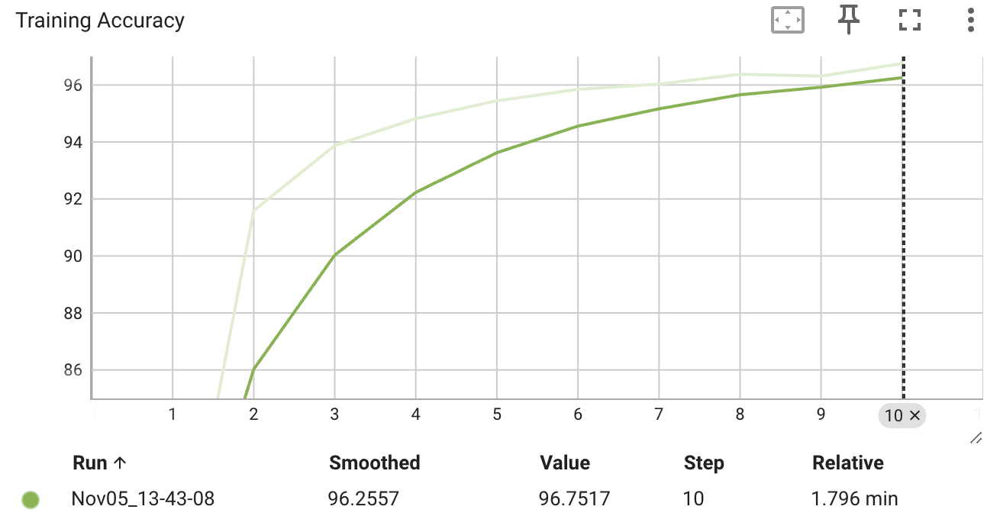
    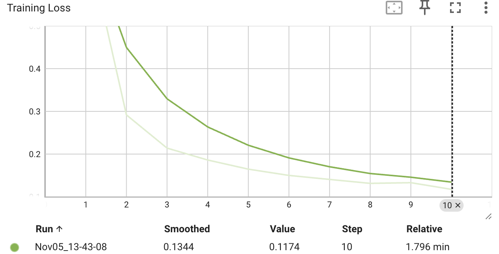
</div>
<div style="display: flex; justify-content: space-around;">
    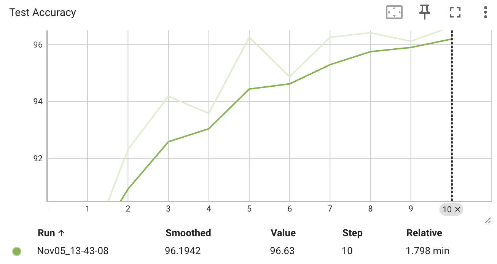
    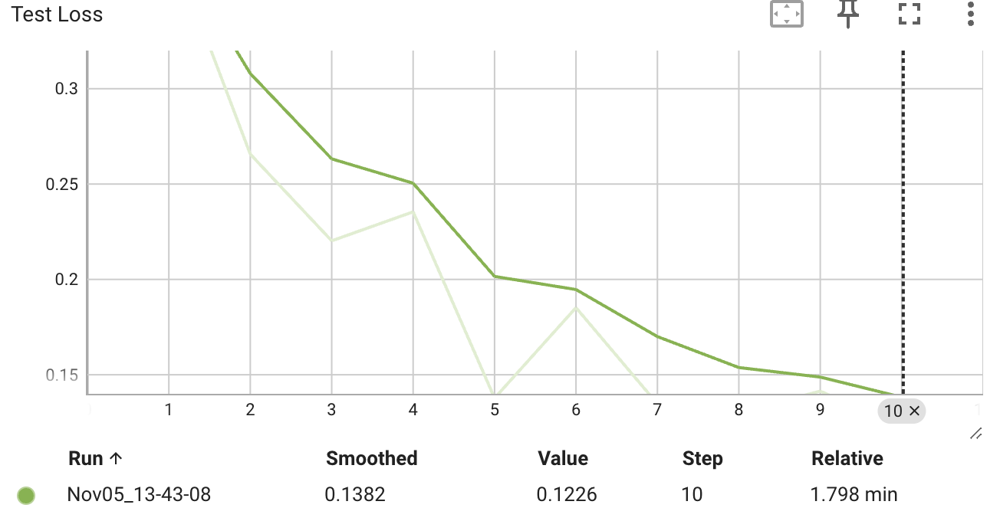
</div>

Execution output:
```
% python assignment_2_part_2_rnn_mnist_skeleton.py
torch.Size([60000, 28, 28])
torch.Size([60000])
2024-11-05 13:43:09.134 python[68822:17633609] +[IMKClient subclass]: chose IMKClient_Legacy
2024-11-05 13:43:09.134 python[68822:17633609] +[IMKInputSession subclass]: chose IMKInputSession_Legacy
2024-11-05 13:43:12.574 python[68822:17633609] The class 'NSSavePanel' overrides the method identifier.  This method is implemented by class 'NSWindow'
Starting Epoch 1/10
Training set: Average loss: 0.7130, Accuracy: 46052/60000 (76.75%)
Test set: Average loss: 0.3785, Accuracy: 8859/10000 (89%)
Epoch 1 Complete: Train Loss = 0.7130, Train Accuracy = 76.75%, Test Accuracy = 88.59%

Starting Epoch 2/10
Training set: Average loss: 0.2917, Accuracy: 54953/60000 (91.59%)
Test set: Average loss: 0.2657, Accuracy: 9231/10000 (92%)
Epoch 2 Complete: Train Loss = 0.2917, Train Accuracy = 91.59%, Test Accuracy = 92.31%

Starting Epoch 3/10
Training set: Average loss: 0.2140, Accuracy: 56327/60000 (93.88%)
Test set: Average loss: 0.2202, Accuracy: 9418/10000 (94%)
Epoch 3 Complete: Train Loss = 0.2140, Train Accuracy = 93.88%, Test Accuracy = 94.18%

Starting Epoch 4/10
Training set: Average loss: 0.1861, Accuracy: 56891/60000 (94.82%)
Test set: Average loss: 0.2354, Accuracy: 9358/10000 (94%)
Epoch 4 Complete: Train Loss = 0.1861, Train Accuracy = 94.82%, Test Accuracy = 93.58%

Starting Epoch 5/10
Training set: Average loss: 0.1647, Accuracy: 57266/60000 (95.44%)
Test set: Average loss: 0.1377, Accuracy: 9626/10000 (96%)
Epoch 5 Complete: Train Loss = 0.1647, Train Accuracy = 95.44%, Test Accuracy = 96.26%

Starting Epoch 6/10
Training set: Average loss: 0.1500, Accuracy: 57508/60000 (95.85%)
Test set: Average loss: 0.1852, Accuracy: 9487/10000 (95%)
Epoch 6 Complete: Train Loss = 0.1500, Train Accuracy = 95.85%, Test Accuracy = 94.87%

Starting Epoch 7/10
Training set: Average loss: 0.1407, Accuracy: 57619/60000 (96.03%)
Test set: Average loss: 0.1347, Accuracy: 9626/10000 (96%)
Epoch 7 Complete: Train Loss = 0.1407, Train Accuracy = 96.03%, Test Accuracy = 96.26%

Starting Epoch 8/10
Training set: Average loss: 0.1314, Accuracy: 57826/60000 (96.38%)
Test set: Average loss: 0.1301, Accuracy: 9642/10000 (96%)
Epoch 8 Complete: Train Loss = 0.1314, Train Accuracy = 96.38%, Test Accuracy = 96.42%

Starting Epoch 9/10
Training set: Average loss: 0.1330, Accuracy: 57787/60000 (96.31%)
Test set: Average loss: 0.1414, Accuracy: 9612/10000 (96%)
Epoch 9 Complete: Train Loss = 0.1330, Train Accuracy = 96.31%, Test Accuracy = 96.12%

Starting Epoch 10/10
Training set: Average loss: 0.1174, Accuracy: 58051/60000 (96.75%)
Test set: Average loss: 0.1226, Accuracy: 9663/10000 (97%)
Epoch 10 Complete: Train Loss = 0.1174, Train Accuracy = 96.75%, Test Accuracy = 96.63%
```

Over the 10 epochs, the model demonstrates significant improvements in both training and test performance. In the first epoch, the training accuracy reaches 76.75% with a test accuracy of 88.59%. As training progresses, both accuracy and loss continue to improve, with the model achieving a final training accuracy of 96.75% and a test accuracy of 96.63%.

This outcome suggests that with a learning rate of 0.001, the RNN is able to effectively learn the underlying patterns in the data, maintaining a stable and consistent convergence throughout training. The steady decrease in both training and test loss across epochs, along with the high final test accuracy, indicates that the model is well-optimized without significant issues related to vanishing gradients or overshooting. 


### 3. b) How about using an LSTM or GRU

Continue using `lr = 0.001`:

#### LSTM Results:
```
Starting Epoch 1/10
Training set: Average loss: 0.4319, Accuracy: 51656/60000 (86.09%)
Test set: Average loss: 0.1571, Accuracy: 9550/10000 (96%)
Epoch 1 Complete: Train Loss = 0.4319, Train Accuracy = 86.09%, Test Accuracy = 95.50%

Starting Epoch 2/10
Training set: Average loss: 0.1209, Accuracy: 57838/60000 (96.40%)
Test set: Average loss: 0.1055, Accuracy: 9674/10000 (97%)
Epoch 2 Complete: Train Loss = 0.1209, Train Accuracy = 96.40%, Test Accuracy = 96.74%

Starting Epoch 3/10
Training set: Average loss: 0.0855, Accuracy: 58461/60000 (97.44%)
Test set: Average loss: 0.0741, Accuracy: 9782/10000 (98%)
Epoch 3 Complete: Train Loss = 0.0855, Train Accuracy = 97.44%, Test Accuracy = 97.82%

Starting Epoch 4/10
Training set: Average loss: 0.0636, Accuracy: 58816/60000 (98.03%)
Test set: Average loss: 0.0751, Accuracy: 9774/10000 (98%)
Epoch 4 Complete: Train Loss = 0.0636, Train Accuracy = 98.03%, Test Accuracy = 97.74%

Starting Epoch 5/10
Training set: Average loss: 0.0542, Accuracy: 58999/60000 (98.33%)
Test set: Average loss: 0.0626, Accuracy: 9814/10000 (98%)
Epoch 5 Complete: Train Loss = 0.0542, Train Accuracy = 98.33%, Test Accuracy = 98.14%

Starting Epoch 6/10
Training set: Average loss: 0.0447, Accuracy: 59149/60000 (98.58%)
Test set: Average loss: 0.0572, Accuracy: 9830/10000 (98%)
Epoch 6 Complete: Train Loss = 0.0447, Train Accuracy = 98.58%, Test Accuracy = 98.30%

Starting Epoch 7/10
Training set: Average loss: 0.0398, Accuracy: 59277/60000 (98.80%)
Test set: Average loss: 0.0527, Accuracy: 9844/10000 (98%)
Epoch 7 Complete: Train Loss = 0.0398, Train Accuracy = 98.80%, Test Accuracy = 98.44%

Starting Epoch 8/10
Training set: Average loss: 0.0352, Accuracy: 59361/60000 (98.94%)
Test set: Average loss: 0.0488, Accuracy: 9856/10000 (99%)
Epoch 8 Complete: Train Loss = 0.0352, Train Accuracy = 98.94%, Test Accuracy = 98.56%

Starting Epoch 9/10
Training set: Average loss: 0.0306, Accuracy: 59450/60000 (99.08%)
Test set: Average loss: 0.0467, Accuracy: 9859/10000 (99%)
Epoch 9 Complete: Train Loss = 0.0306, Train Accuracy = 99.08%, Test Accuracy = 98.59%

Starting Epoch 10/10
Training set: Average loss: 0.0284, Accuracy: 59491/60000 (99.15%)
Test set: Average loss: 0.0604, Accuracy: 9835/10000 (98%)
Epoch 10 Complete: Train Loss = 0.0284, Train Accuracy = 99.15%, Test Accuracy = 98.35%
```

<div style="display: flex; justify-content: space-around;">
    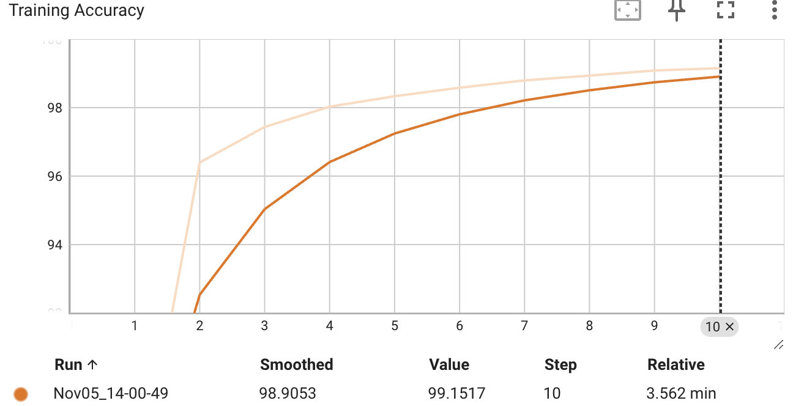
    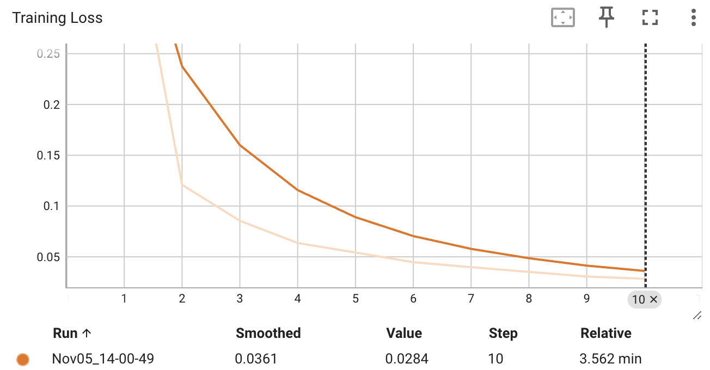
</div>
<div style="display: flex; justify-content: space-around;">
    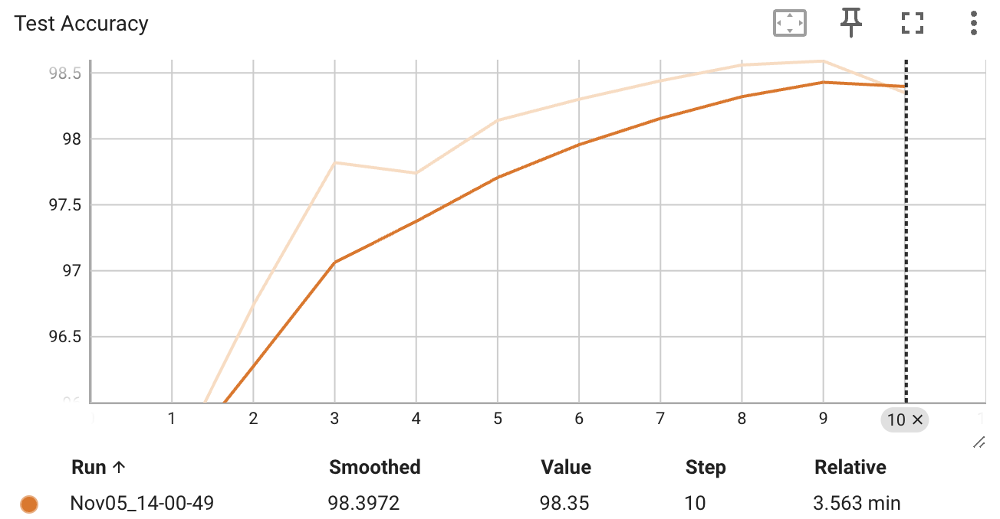
    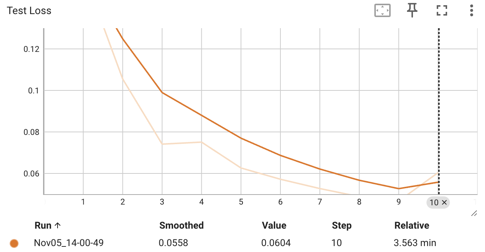
</div>

#### GRU Results:
```
Starting Epoch 1/10
Training set: Average loss: 0.4527, Accuracy: 51143/60000 (85.24%)
Test set: Average loss: 0.1395, Accuracy: 9584/10000 (96%)
Epoch 1 Complete: Train Loss = 0.4527, Train Accuracy = 85.24%, Test Accuracy = 95.84%

Starting Epoch 2/10
Training set: Average loss: 0.1057, Accuracy: 58097/60000 (96.83%)
Test set: Average loss: 0.0936, Accuracy: 9727/10000 (97%)
Epoch 2 Complete: Train Loss = 0.1057, Train Accuracy = 96.83%, Test Accuracy = 97.27%

Starting Epoch 3/10
Training set: Average loss: 0.0738, Accuracy: 58639/60000 (97.73%)
Test set: Average loss: 0.0649, Accuracy: 9797/10000 (98%)
Epoch 3 Complete: Train Loss = 0.0738, Train Accuracy = 97.73%, Test Accuracy = 97.97%

Starting Epoch 4/10
Training set: Average loss: 0.0561, Accuracy: 58971/60000 (98.28%)
Test set: Average loss: 0.0519, Accuracy: 9843/10000 (98%)
Epoch 4 Complete: Train Loss = 0.0561, Train Accuracy = 98.28%, Test Accuracy = 98.43%

Starting Epoch 5/10
Training set: Average loss: 0.0450, Accuracy: 59157/60000 (98.59%)
Test set: Average loss: 0.0547, Accuracy: 9831/10000 (98%)
Epoch 5 Complete: Train Loss = 0.0450, Train Accuracy = 98.59%, Test Accuracy = 98.31%

Starting Epoch 6/10
Training set: Average loss: 0.0372, Accuracy: 59321/60000 (98.87%)
Test set: Average loss: 0.0600, Accuracy: 9823/10000 (98%)
Epoch 6 Complete: Train Loss = 0.0372, Train Accuracy = 98.87%, Test Accuracy = 98.23%

Starting Epoch 7/10
Training set: Average loss: 0.0326, Accuracy: 59391/60000 (98.98%)
Test set: Average loss: 0.0471, Accuracy: 9863/10000 (99%)
Epoch 7 Complete: Train Loss = 0.0326, Train Accuracy = 98.98%, Test Accuracy = 98.63%

Starting Epoch 8/10
Training set: Average loss: 0.0271, Accuracy: 59480/60000 (99.13%)
Test set: Average loss: 0.0497, Accuracy: 9854/10000 (99%)
Epoch 8 Complete: Train Loss = 0.0271, Train Accuracy = 99.13%, Test Accuracy = 98.54%

Starting Epoch 9/10
Training set: Average loss: 0.0253, Accuracy: 59508/60000 (99.18%)
Test set: Average loss: 0.0393, Accuracy: 9882/10000 (99%)
Epoch 9 Complete: Train Loss = 0.0253, Train Accuracy = 99.18%, Test Accuracy = 98.82%

Starting Epoch 10/10
Training set: Average loss: 0.0210, Accuracy: 59595/60000 (99.33%)
Test set: Average loss: 0.0377, Accuracy: 9882/10000 (99%)
Epoch 10 Complete: Train Loss = 0.0210, Train Accuracy = 99.33%, Test Accuracy = 98.82%
```

<div style="display: flex; justify-content: space-around;">
    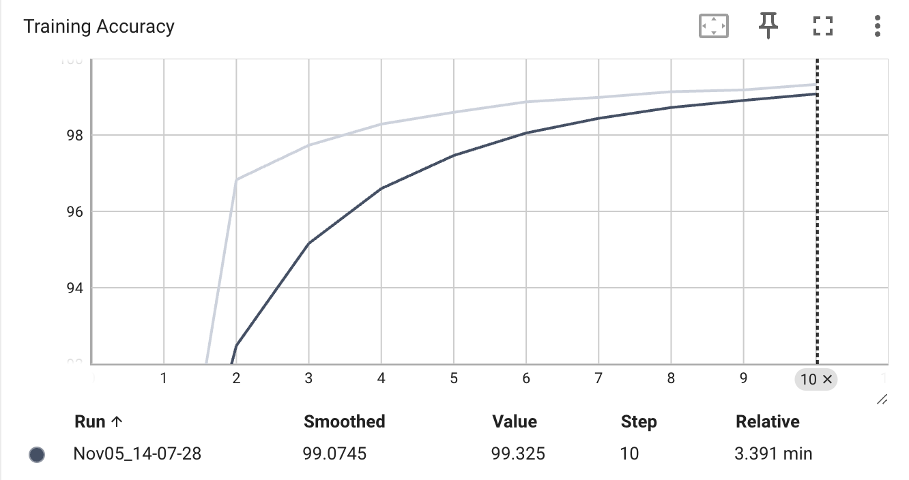
    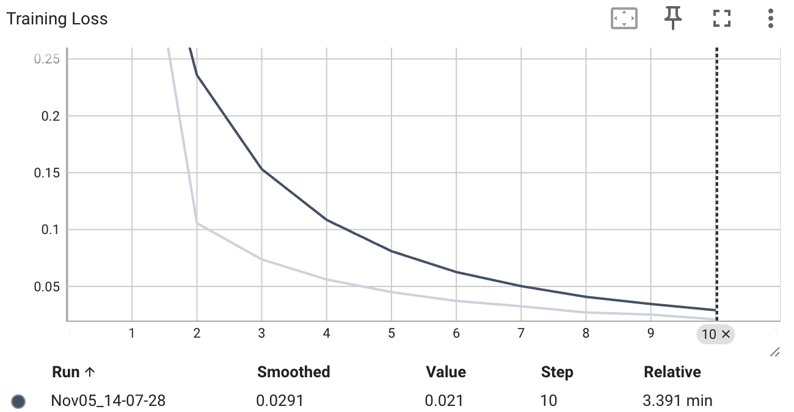
</div>
<div style="display: flex; justify-content: space-around;">
    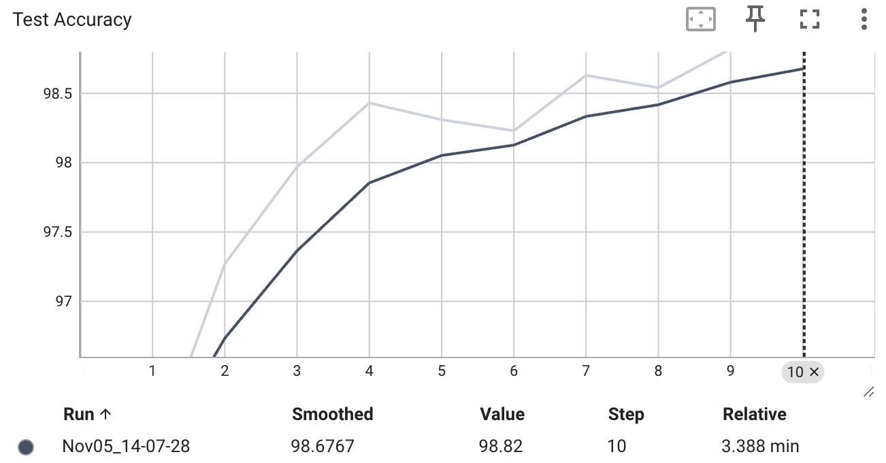
    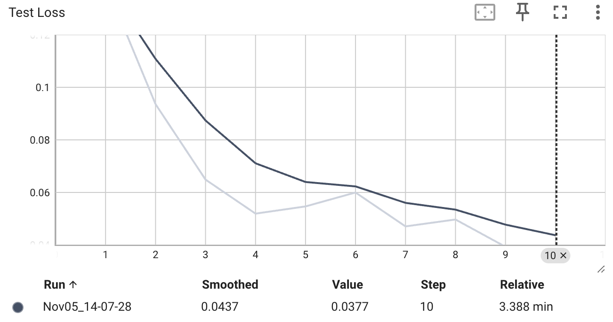
</div>

#### Accuracy Comparison:
- **RNN**: As mentioned in section 3.a), the RNN model reaches a training accuracy of 76.75% and test accuracy of 88.59% in the first epoch. Throughout the training process, accuracy continues to improve, with the model achieving final accuracies of 96.75% for training and 96.63% for testing by the end of 10 epochs. This demonstrates the model’s ability to learn meaningful patterns with the revised learning rate (rather than lr = 0.01 with only about 10% accuracy).
- **LSTM**: The LSTM model starts with strong performance, achieving a training accuracy of 86.09% and a test accuracy of 95.50% in the first epoch. With each subsequent epoch, the model shows steady improvement, reaching a final training accuracy of 99.15% and test accuracy of 98.35%. This demonstrates that the LSTM is highly effective at capturing patterns in the data with high stability across epochs.
- **GRU**: The GRU model also exhibits strong initial performance, with a training accuracy of 85.24% and test accuracy of 95.84% in the first epoch. Like the LSTM, the GRU model continues to improve with each epoch, culminating in a final training accuracy of 99.33% and test accuracy of 98.82%, making it slightly more accurate on the test set compared to the LSTM.

#### Loss Comparison:
- **RNN**: The RNN model exhibited a consistent decline in loss over the epochs, with the training loss decreasing from 0.7130 to 0.1174 and the test loss reducing from 0.3785 to 0.1226. This steady loss reduction reflects a well-converging model capable of effectively learning features over time.
- **LSTM and GRU**: Both LSTM and GRU models showed rapid and significant loss reductions in the initial epochs, with training and test losses staying low and relatively stable afterward. The final LSTM losses were 0.0284 for training and 0.0604 for testing, while the GRU ended with 0.0210 for training and 0.0377 for testing. These results illustrate that LSTM and GRU adapt well to the data, achieving even lower final losses than the RNN.

#### Change the number of hidden units

The results for different hidden sizes (64, 128, 256, 512) are shown in the table below:

| Model Type | Hidden Size | Train Accuracy (Final) | Test Accuracy (Final) | Train Loss (Final) | Test Loss (Final) |
| ---------- | ----------- | ---------------------- | --------------------- | ------------------ | ----------------- |
| **RNN**    | 64          | 94.50%                 | 94.90%                | 0.1981             | 0.1823            |
|            | 128         | 96.67%                 | 95.63%                | 0.1177             | 0.1645            |
|            | 256         | 96.28%                 | 96.49%                | 0.1299             | 0.1317            |
|            | 512         | 95.63%                 | 93.70%                | 0.1513             | 0.224             |
| **LSTM**   | 64          | 98.72%                 | 97.87%                | 0.0427             | 0.0739            |
|            | 128         | 99.21%                 | 98.14%                | 0.026              | 0.0623            |
|            | 256         | 99.40%                 | 98.74%                | 0.0196             | 0.0415            |
|            | 512         | 99.43%                 | 98.87%                | 0.018              | 0.0366            |
| **GRU**    | 64          | 98.83%                 | 98.42%                | 0.0378             | 0.0557            |
|            | 128         | 99.32%                 | 98.27%                | 0.0208             | 0.0579            |
|            | 256         | 99.46%                 | 98.86%                | 0.0165             | 0.0411            |
|            | 512         | 99.55%                 | 98.93%                | 0.0146             | 0.0442            |

<div style="display: flex; justify-content: space-around;">
    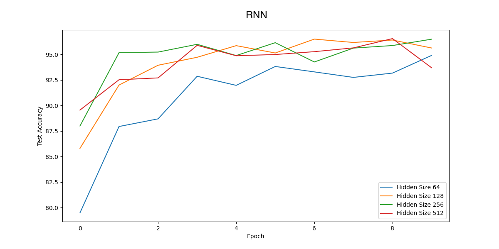
    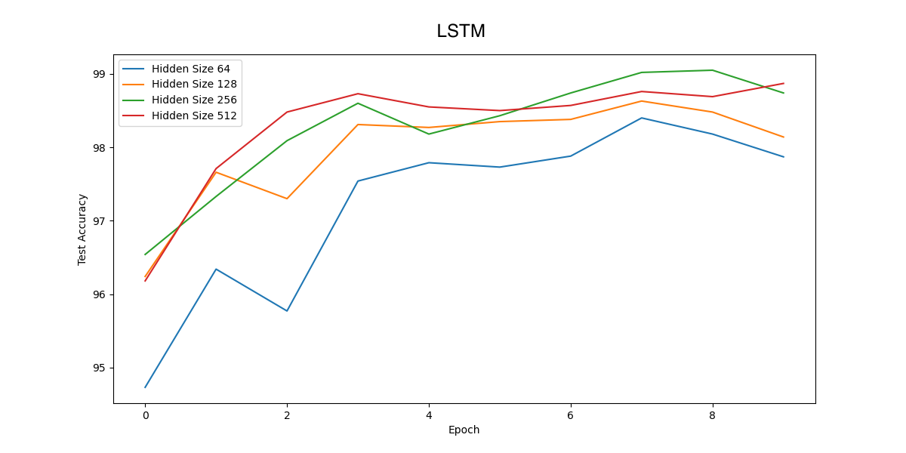
    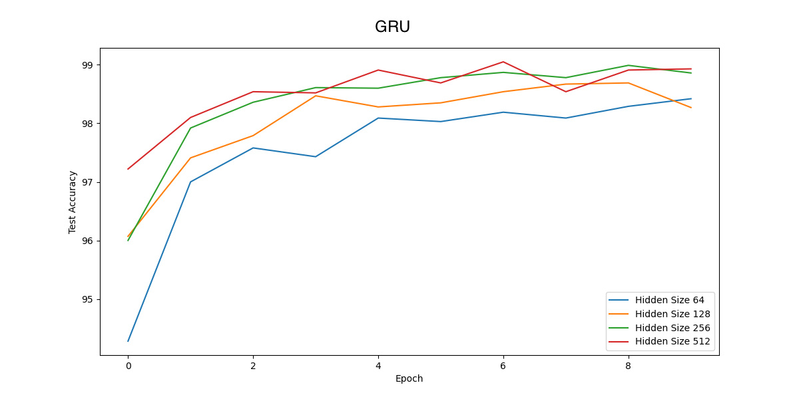
</div>

**Analysis of Results**:
- **RNN**: Increasing the number of hidden units noticeably improves the RNN’s performance, with training and test accuracy reaching 94.50% and 94.90%, respectively, at 64 hidden units. However, as the hidden size increases, the improvements plateau, and test accuracy fluctuates. This highlights that while RNNs can learn some patterns at lower hidden sizes, they may struggle with further complexity on this task, especially compared to other models.
- **LSTM**: LSTM demonstrates high effectiveness across all hidden sizes, with final test accuracy consistently around or above 97%. At 256 and 512 hidden units, it reaches peak performance, achieving up to 98.87% test accuracy. The model converges well, and larger hidden sizes (128 and above) lead to faster and more stable improvements, showcasing LSTM's strong capacity for capturing complex sequential dependencies.
- **GRU**: GRU also performs well, with its best test accuracy reaching 99.05% at 512 hidden units. Performance is stable across hidden sizes, and like the LSTM, GRU benefits from increased hidden units, although its gains taper slightly beyond 256 units. The GRU’s performance closely aligns with the LSTM, proving effective even with fewer parameters in smaller hidden configurations.

**Summary**:
- LSTM and GRU models substantially outperform the RNN, showing they are far more suited to handling sequential data and maintaining performance across varying hidden sizes.
- Higher hidden units generally boost performance, yet excessive parameters may lead to diminishing returns, making it necessary to balance model complexity and training stability.


### 3. c) Compare against the CNN

Compare with training using convnet in assignment 1: 

1. **Architecture**:
- **CNN**: The CNN model from Assignment 1 is a deep convolutional network with four layers, specifically designed for image recognition tasks like MNIST. CNNs excel at capturing spatial hierarchies in data through convolutional filters, making them highly effective at extracting features from image data.
- **RNN**: Although RNNs are generally optimized for sequential data, here they process each MNIST image as a flattened sequence of pixels, allowing the model to capture some level of pixel dependencies. However, RNNs are not inherently suited for spatial data, meaning they might miss spatial hierarchies captured more effectively by CNNs.

2. **Accuracy**:
- **CNN**: In Assignment 1, the CNN achieved up to 99% accuracy on the MNIST dataset, highlighting its effectiveness in learning spatial features essential for image classification.
- **RNN**: With a learning rate of 0.001, the RNN model achieved a test accuracy of 96.63% by the end of 10 epochs. While still slightly below the CNN's accuracy, this result demonstrates a notable improvement and shows that RNNs can achieve competitive performance on MNIST, despite being less suited for image tasks.

3. **Convergence**:
- **CNN**: CNNs typically converge faster on image data, as convolutional layers efficiently capture important features with fewer parameters, allowing the model to learn effectively in fewer epochs.
- **RNN**: The RNN in this experiment reached competitive accuracy within 10 epochs, though it required careful tuning (e.g., setting a learning rate of 0.001) to stabilize and achieve rapid improvement. Compared to the CNN, the RNN converged slightly slower initially, but it managed to reach a high accuracy within a similar timeframe after optimization.

4. **Stability**:
- **CNN**: CNNs demonstrate stable training on image data, avoiding issues such as vanishing or exploding gradients, thanks to the local receptive fields of convolutional and pooling layers.
- **RNN**: RNNs may face stability challenges, especially on longer sequences, due to issues like vanishing or exploding gradients. However, in this experiment, with an optimized learning rate, the RNN achieved stable training and avoided major gradient issues.

In conclusion, although CNNs have an inherent advantage in spatial feature extraction for image classification tasks like MNIST, the RNN—with optimized parameters—achieved competitive performance, converging effectively and reaching a high accuracy. This highlights the flexibility of RNNs when properly tuned, though CNNs still maintain an edge in handling image data due to their ability to naturally capture spatial structures.

<!-- # hiddent test
RNN:
```
Testing model with hidden size = 64
Starting Epoch 1/10 with hidden size 64
Training set: Average loss: 0.9560, Accuracy: 40248/60000 (67.08%)
Test set: Average loss: 0.5855, Accuracy: 7948/10000 (79%)
Epoch 1 Complete: Train Loss = 0.9560, Train Accuracy = 67.08%, Test Accuracy = 79.48%

Starting Epoch 2/10 with hidden size 64
Training set: Average loss: 0.4769, Accuracy: 51274/60000 (85.46%)
Test set: Average loss: 0.3988, Accuracy: 8794/10000 (88%)
Epoch 2 Complete: Train Loss = 0.4769, Train Accuracy = 85.46%, Test Accuracy = 87.94%

Starting Epoch 3/10 with hidden size 64
Training set: Average loss: 0.3697, Accuracy: 53690/60000 (89.48%)
Test set: Average loss: 0.3832, Accuracy: 8869/10000 (89%)
Epoch 3 Complete: Train Loss = 0.3697, Train Accuracy = 89.48%, Test Accuracy = 88.69%

Starting Epoch 4/10 with hidden size 64
Training set: Average loss: 0.3158, Accuracy: 54720/60000 (91.20%)
Test set: Average loss: 0.2665, Accuracy: 9286/10000 (93%)
Epoch 4 Complete: Train Loss = 0.3158, Train Accuracy = 91.20%, Test Accuracy = 92.86%

Starting Epoch 5/10 with hidden size 64
Training set: Average loss: 0.2750, Accuracy: 55395/60000 (92.33%)
Test set: Average loss: 0.2803, Accuracy: 9197/10000 (92%)
Epoch 5 Complete: Train Loss = 0.2750, Train Accuracy = 92.33%, Test Accuracy = 91.97%

Starting Epoch 6/10 with hidden size 64
Training set: Average loss: 0.2502, Accuracy: 55861/60000 (93.10%)
Test set: Average loss: 0.2290, Accuracy: 9382/10000 (94%)
Epoch 6 Complete: Train Loss = 0.2502, Train Accuracy = 93.10%, Test Accuracy = 93.82%

Starting Epoch 7/10 with hidden size 64
Training set: Average loss: 0.2370, Accuracy: 56051/60000 (93.42%)
Test set: Average loss: 0.2447, Accuracy: 9329/10000 (93%)
Epoch 7 Complete: Train Loss = 0.2370, Train Accuracy = 93.42%, Test Accuracy = 93.29%

Starting Epoch 8/10 with hidden size 64
Training set: Average loss: 0.2198, Accuracy: 56330/60000 (93.88%)
Test set: Average loss: 0.2487, Accuracy: 9275/10000 (93%)
Epoch 8 Complete: Train Loss = 0.2198, Train Accuracy = 93.88%, Test Accuracy = 92.75%

Starting Epoch 9/10 with hidden size 64
Training set: Average loss: 0.2043, Accuracy: 56551/60000 (94.25%)
Test set: Average loss: 0.2392, Accuracy: 9317/10000 (93%)
Epoch 9 Complete: Train Loss = 0.2043, Train Accuracy = 94.25%, Test Accuracy = 93.17%

Starting Epoch 10/10 with hidden size 64
Training set: Average loss: 0.1981, Accuracy: 56701/60000 (94.50%)
Test set: Average loss: 0.1823, Accuracy: 9490/10000 (95%)
Epoch 10 Complete: Train Loss = 0.1981, Train Accuracy = 94.50%, Test Accuracy = 94.90%


Testing model with hidden size = 128
Starting Epoch 1/10 with hidden size 128
Training set: Average loss: 0.7828, Accuracy: 44521/60000 (74.20%)
Test set: Average loss: 0.4838, Accuracy: 8580/10000 (86%)
Epoch 1 Complete: Train Loss = 0.7828, Train Accuracy = 74.20%, Test Accuracy = 85.80%

Starting Epoch 2/10 with hidden size 128
Training set: Average loss: 0.3475, Accuracy: 54043/60000 (90.07%)
Test set: Average loss: 0.2775, Accuracy: 9200/10000 (92%)
Epoch 2 Complete: Train Loss = 0.3475, Train Accuracy = 90.07%, Test Accuracy = 92.00%

Starting Epoch 3/10 with hidden size 128
Training set: Average loss: 0.2541, Accuracy: 55626/60000 (92.71%)
Test set: Average loss: 0.2105, Accuracy: 9394/10000 (94%)
Epoch 3 Complete: Train Loss = 0.2541, Train Accuracy = 92.71%, Test Accuracy = 93.94%

Starting Epoch 4/10 with hidden size 128
Training set: Average loss: 0.1995, Accuracy: 56642/60000 (94.40%)
Test set: Average loss: 0.1930, Accuracy: 9472/10000 (95%)
Epoch 4 Complete: Train Loss = 0.1995, Train Accuracy = 94.40%, Test Accuracy = 94.72%

Starting Epoch 5/10 with hidden size 128
Training set: Average loss: 0.1655, Accuracy: 57194/60000 (95.32%)
Test set: Average loss: 0.1488, Accuracy: 9586/10000 (96%)
Epoch 5 Complete: Train Loss = 0.1655, Train Accuracy = 95.32%, Test Accuracy = 95.86%

Starting Epoch 6/10 with hidden size 128
Training set: Average loss: 0.1543, Accuracy: 57384/60000 (95.64%)
Test set: Average loss: 0.1719, Accuracy: 9514/10000 (95%)
Epoch 6 Complete: Train Loss = 0.1543, Train Accuracy = 95.64%, Test Accuracy = 95.14%

Starting Epoch 7/10 with hidden size 128
Training set: Average loss: 0.1428, Accuracy: 57541/60000 (95.90%)
Test set: Average loss: 0.1289, Accuracy: 9650/10000 (96%)
Epoch 7 Complete: Train Loss = 0.1428, Train Accuracy = 95.90%, Test Accuracy = 96.50%

Starting Epoch 8/10 with hidden size 128
Training set: Average loss: 0.1260, Accuracy: 57892/60000 (96.49%)
Test set: Average loss: 0.1432, Accuracy: 9617/10000 (96%)
Epoch 8 Complete: Train Loss = 0.1260, Train Accuracy = 96.49%, Test Accuracy = 96.17%

Starting Epoch 9/10 with hidden size 128
Training set: Average loss: 0.1356, Accuracy: 57677/60000 (96.13%)
Test set: Average loss: 0.1321, Accuracy: 9641/10000 (96%)
Epoch 9 Complete: Train Loss = 0.1356, Train Accuracy = 96.13%, Test Accuracy = 96.41%

Starting Epoch 10/10 with hidden size 128
Training set: Average loss: 0.1177, Accuracy: 58001/60000 (96.67%)
Test set: Average loss: 0.1645, Accuracy: 9563/10000 (96%)
Epoch 10 Complete: Train Loss = 0.1177, Train Accuracy = 96.67%, Test Accuracy = 95.63%


Testing model with hidden size = 256
Starting Epoch 1/10 with hidden size 256
Training set: Average loss: 0.6643, Accuracy: 47047/60000 (78.41%)
Test set: Average loss: 0.4113, Accuracy: 8799/10000 (88%)
Epoch 1 Complete: Train Loss = 0.6643, Train Accuracy = 78.41%, Test Accuracy = 87.99%

Starting Epoch 2/10 with hidden size 256
Training set: Average loss: 0.2742, Accuracy: 55304/60000 (92.17%)
Test set: Average loss: 0.1716, Accuracy: 9517/10000 (95%)
Epoch 2 Complete: Train Loss = 0.2742, Train Accuracy = 92.17%, Test Accuracy = 95.17%

Starting Epoch 3/10 with hidden size 256
Training set: Average loss: 0.2082, Accuracy: 56424/60000 (94.04%)
Test set: Average loss: 0.1662, Accuracy: 9523/10000 (95%)
Epoch 3 Complete: Train Loss = 0.2082, Train Accuracy = 94.04%, Test Accuracy = 95.23%

Starting Epoch 4/10 with hidden size 256
Training set: Average loss: 0.1790, Accuracy: 56941/60000 (94.90%)
Test set: Average loss: 0.1454, Accuracy: 9599/10000 (96%)
Epoch 4 Complete: Train Loss = 0.1790, Train Accuracy = 94.90%, Test Accuracy = 95.99%

Starting Epoch 5/10 with hidden size 256
Training set: Average loss: 0.1596, Accuracy: 57223/60000 (95.37%)
Test set: Average loss: 0.1682, Accuracy: 9489/10000 (95%)
Epoch 5 Complete: Train Loss = 0.1596, Train Accuracy = 95.37%, Test Accuracy = 94.89%

Starting Epoch 6/10 with hidden size 256
Training set: Average loss: 0.1470, Accuracy: 57527/60000 (95.88%)
Test set: Average loss: 0.1461, Accuracy: 9615/10000 (96%)
Epoch 6 Complete: Train Loss = 0.1470, Train Accuracy = 95.88%, Test Accuracy = 96.15%

Starting Epoch 7/10 with hidden size 256
Training set: Average loss: 0.1356, Accuracy: 57689/60000 (96.15%)
Test set: Average loss: 0.2049, Accuracy: 9426/10000 (94%)
Epoch 7 Complete: Train Loss = 0.1356, Train Accuracy = 96.15%, Test Accuracy = 94.26%

Starting Epoch 8/10 with hidden size 256
Training set: Average loss: 0.1383, Accuracy: 57644/60000 (96.07%)
Test set: Average loss: 0.1607, Accuracy: 9562/10000 (96%)
Epoch 8 Complete: Train Loss = 0.1383, Train Accuracy = 96.07%, Test Accuracy = 95.62%

Starting Epoch 9/10 with hidden size 256
Training set: Average loss: 0.1277, Accuracy: 57856/60000 (96.43%)
Test set: Average loss: 0.1565, Accuracy: 9587/10000 (96%)
Epoch 9 Complete: Train Loss = 0.1277, Train Accuracy = 96.43%, Test Accuracy = 95.87%

Starting Epoch 10/10 with hidden size 256
Training set: Average loss: 0.1299, Accuracy: 57769/60000 (96.28%)
Test set: Average loss: 0.1317, Accuracy: 9649/10000 (96%)
Epoch 10 Complete: Train Loss = 0.1299, Train Accuracy = 96.28%, Test Accuracy = 96.49%


Testing model with hidden size = 512
Starting Epoch 1/10 with hidden size 512
Training set: Average loss: 0.5990, Accuracy: 48593/60000 (80.99%)
Test set: Average loss: 0.3544, Accuracy: 8955/10000 (90%)
Epoch 1 Complete: Train Loss = 0.5990, Train Accuracy = 80.99%, Test Accuracy = 89.55%

Starting Epoch 2/10 with hidden size 512
Training set: Average loss: 0.2801, Accuracy: 55147/60000 (91.91%)
Test set: Average loss: 0.2542, Accuracy: 9252/10000 (93%)
Epoch 2 Complete: Train Loss = 0.2801, Train Accuracy = 91.91%, Test Accuracy = 92.52%

Starting Epoch 3/10 with hidden size 512
Training set: Average loss: 0.2303, Accuracy: 56056/60000 (93.43%)
Test set: Average loss: 0.2544, Accuracy: 9270/10000 (93%)
Epoch 3 Complete: Train Loss = 0.2303, Train Accuracy = 93.43%, Test Accuracy = 92.70%

Starting Epoch 4/10 with hidden size 512
Training set: Average loss: 0.1880, Accuracy: 56782/60000 (94.64%)
Test set: Average loss: 0.1476, Accuracy: 9589/10000 (96%)
Epoch 4 Complete: Train Loss = 0.1880, Train Accuracy = 94.64%, Test Accuracy = 95.89%

Starting Epoch 5/10 with hidden size 512
Training set: Average loss: 0.1817, Accuracy: 56875/60000 (94.79%)
Test set: Average loss: 0.1726, Accuracy: 9487/10000 (95%)
Epoch 5 Complete: Train Loss = 0.1817, Train Accuracy = 94.79%, Test Accuracy = 94.87%

Starting Epoch 6/10 with hidden size 512
Training set: Average loss: 0.1689, Accuracy: 57147/60000 (95.25%)
Test set: Average loss: 0.1845, Accuracy: 9499/10000 (95%)
Epoch 6 Complete: Train Loss = 0.1689, Train Accuracy = 95.25%, Test Accuracy = 94.99%

Starting Epoch 7/10 with hidden size 512
Training set: Average loss: 0.1659, Accuracy: 57130/60000 (95.22%)
Test set: Average loss: 0.1658, Accuracy: 9527/10000 (95%)
Epoch 7 Complete: Train Loss = 0.1659, Train Accuracy = 95.22%, Test Accuracy = 95.27%

Starting Epoch 8/10 with hidden size 512
Training set: Average loss: 0.1540, Accuracy: 57366/60000 (95.61%)
Test set: Average loss: 0.1594, Accuracy: 9564/10000 (96%)
Epoch 8 Complete: Train Loss = 0.1540, Train Accuracy = 95.61%, Test Accuracy = 95.64%

Starting Epoch 9/10 with hidden size 512
Training set: Average loss: 0.1588, Accuracy: 57285/60000 (95.47%)
Test set: Average loss: 0.1259, Accuracy: 9655/10000 (97%)
Epoch 9 Complete: Train Loss = 0.1588, Train Accuracy = 95.47%, Test Accuracy = 96.55%

Starting Epoch 10/10 with hidden size 512
Training set: Average loss: 0.1513, Accuracy: 57378/60000 (95.63%)
Test set: Average loss: 0.2240, Accuracy: 9370/10000 (94%)
Epoch 10 Complete: Train Loss = 0.1513, Train Accuracy = 95.63%, Test Accuracy = 93.70%
```

LSTM:
```
Testing model with hidden size = 64
Starting Epoch 1/10 with hidden size 64
Training set: Average loss: 0.5321, Accuracy: 49946/60000 (83.24%)
Test set: Average loss: 0.1784, Accuracy: 9473/10000 (95%)
Epoch 1 Complete: Train Loss = 0.5321, Train Accuracy = 83.24%, Test Accuracy = 94.73%

Starting Epoch 2/10 with hidden size 64
Training set: Average loss: 0.1506, Accuracy: 57379/60000 (95.63%)
Test set: Average loss: 0.1261, Accuracy: 9634/10000 (96%)
Epoch 2 Complete: Train Loss = 0.1506, Train Accuracy = 95.63%, Test Accuracy = 96.34%

Starting Epoch 3/10 with hidden size 64
Training set: Average loss: 0.1115, Accuracy: 58038/60000 (96.73%)
Test set: Average loss: 0.1340, Accuracy: 9577/10000 (96%)
Epoch 3 Complete: Train Loss = 0.1115, Train Accuracy = 96.73%, Test Accuracy = 95.77%

Starting Epoch 4/10 with hidden size 64
Training set: Average loss: 0.0899, Accuracy: 58391/60000 (97.32%)
Test set: Average loss: 0.0843, Accuracy: 9754/10000 (98%)
Epoch 4 Complete: Train Loss = 0.0899, Train Accuracy = 97.32%, Test Accuracy = 97.54%

Starting Epoch 5/10 with hidden size 64
Training set: Average loss: 0.0728, Accuracy: 58718/60000 (97.86%)
Test set: Average loss: 0.0750, Accuracy: 9779/10000 (98%)
Epoch 5 Complete: Train Loss = 0.0728, Train Accuracy = 97.86%, Test Accuracy = 97.79%

Starting Epoch 6/10 with hidden size 64
Training set: Average loss: 0.0659, Accuracy: 58864/60000 (98.11%)
Test set: Average loss: 0.0810, Accuracy: 9773/10000 (98%)
Epoch 6 Complete: Train Loss = 0.0659, Train Accuracy = 98.11%, Test Accuracy = 97.73%

Starting Epoch 7/10 with hidden size 64
Training set: Average loss: 0.0578, Accuracy: 58974/60000 (98.29%)
Test set: Average loss: 0.0755, Accuracy: 9788/10000 (98%)
Epoch 7 Complete: Train Loss = 0.0578, Train Accuracy = 98.29%, Test Accuracy = 97.88%

Starting Epoch 8/10 with hidden size 64
Training set: Average loss: 0.0525, Accuracy: 59048/60000 (98.41%)
Test set: Average loss: 0.0596, Accuracy: 9840/10000 (98%)
Epoch 8 Complete: Train Loss = 0.0525, Train Accuracy = 98.41%, Test Accuracy = 98.40%

Starting Epoch 9/10 with hidden size 64
Training set: Average loss: 0.0472, Accuracy: 59115/60000 (98.53%)
Test set: Average loss: 0.0610, Accuracy: 9818/10000 (98%)
Epoch 9 Complete: Train Loss = 0.0472, Train Accuracy = 98.53%, Test Accuracy = 98.18%

Starting Epoch 10/10 with hidden size 64
Training set: Average loss: 0.0427, Accuracy: 59234/60000 (98.72%)
Test set: Average loss: 0.0739, Accuracy: 9787/10000 (98%)
Epoch 10 Complete: Train Loss = 0.0427, Train Accuracy = 98.72%, Test Accuracy = 97.87%


Testing model with hidden size = 128
Starting Epoch 1/10 with hidden size 128
Training set: Average loss: 0.4354, Accuracy: 51474/60000 (85.79%)
Test set: Average loss: 0.1279, Accuracy: 9624/10000 (96%)
Epoch 1 Complete: Train Loss = 0.4354, Train Accuracy = 85.79%, Test Accuracy = 96.24%

Starting Epoch 2/10 with hidden size 128
Training set: Average loss: 0.1087, Accuracy: 58072/60000 (96.79%)
Test set: Average loss: 0.0789, Accuracy: 9766/10000 (98%)
Epoch 2 Complete: Train Loss = 0.1087, Train Accuracy = 96.79%, Test Accuracy = 97.66%

Starting Epoch 3/10 with hidden size 128
Training set: Average loss: 0.0770, Accuracy: 58603/60000 (97.67%)
Test set: Average loss: 0.0814, Accuracy: 9730/10000 (97%)
Epoch 3 Complete: Train Loss = 0.0770, Train Accuracy = 97.67%, Test Accuracy = 97.30%

Starting Epoch 4/10 with hidden size 128
Training set: Average loss: 0.0606, Accuracy: 58932/60000 (98.22%)
Test set: Average loss: 0.0571, Accuracy: 9831/10000 (98%)
Epoch 4 Complete: Train Loss = 0.0606, Train Accuracy = 98.22%, Test Accuracy = 98.31%

Starting Epoch 5/10 with hidden size 128
Training set: Average loss: 0.0496, Accuracy: 59081/60000 (98.47%)
Test set: Average loss: 0.0589, Accuracy: 9827/10000 (98%)
Epoch 5 Complete: Train Loss = 0.0496, Train Accuracy = 98.47%, Test Accuracy = 98.27%

Starting Epoch 6/10 with hidden size 128
Training set: Average loss: 0.0435, Accuracy: 59198/60000 (98.66%)
Test set: Average loss: 0.0523, Accuracy: 9835/10000 (98%)
Epoch 6 Complete: Train Loss = 0.0435, Train Accuracy = 98.66%, Test Accuracy = 98.35%

Starting Epoch 7/10 with hidden size 128
Training set: Average loss: 0.0354, Accuracy: 59371/60000 (98.95%)
Test set: Average loss: 0.0549, Accuracy: 9838/10000 (98%)
Epoch 7 Complete: Train Loss = 0.0354, Train Accuracy = 98.95%, Test Accuracy = 98.38%

Starting Epoch 8/10 with hidden size 128
Training set: Average loss: 0.0325, Accuracy: 59393/60000 (98.99%)
Test set: Average loss: 0.0410, Accuracy: 9863/10000 (99%)
Epoch 8 Complete: Train Loss = 0.0325, Train Accuracy = 98.99%, Test Accuracy = 98.63%

Starting Epoch 9/10 with hidden size 128
Training set: Average loss: 0.0306, Accuracy: 59420/60000 (99.03%)
Test set: Average loss: 0.0547, Accuracy: 9848/10000 (98%)
Epoch 9 Complete: Train Loss = 0.0306, Train Accuracy = 99.03%, Test Accuracy = 98.48%

Starting Epoch 10/10 with hidden size 128
Training set: Average loss: 0.0260, Accuracy: 59526/60000 (99.21%)
Test set: Average loss: 0.0623, Accuracy: 9814/10000 (98%)
Epoch 10 Complete: Train Loss = 0.0260, Train Accuracy = 99.21%, Test Accuracy = 98.14%


Testing model with hidden size = 256
Starting Epoch 1/10 with hidden size 256
Training set: Average loss: 0.3504, Accuracy: 53186/60000 (88.64%)
Test set: Average loss: 0.1185, Accuracy: 9654/10000 (97%)
Epoch 1 Complete: Train Loss = 0.3504, Train Accuracy = 88.64%, Test Accuracy = 96.54%

Starting Epoch 2/10 with hidden size 256
Training set: Average loss: 0.0920, Accuracy: 58353/60000 (97.25%)
Test set: Average loss: 0.0878, Accuracy: 9733/10000 (97%)
Epoch 2 Complete: Train Loss = 0.0920, Train Accuracy = 97.25%, Test Accuracy = 97.33%

Starting Epoch 3/10 with hidden size 256
Training set: Average loss: 0.0658, Accuracy: 58815/60000 (98.03%)
Test set: Average loss: 0.0659, Accuracy: 9809/10000 (98%)
Epoch 3 Complete: Train Loss = 0.0658, Train Accuracy = 98.03%, Test Accuracy = 98.09%

Starting Epoch 4/10 with hidden size 256
Training set: Average loss: 0.0481, Accuracy: 59147/60000 (98.58%)
Test set: Average loss: 0.0482, Accuracy: 9860/10000 (99%)
Epoch 4 Complete: Train Loss = 0.0481, Train Accuracy = 98.58%, Test Accuracy = 98.60%

Starting Epoch 5/10 with hidden size 256
Training set: Average loss: 0.0430, Accuracy: 59189/60000 (98.65%)
Test set: Average loss: 0.0585, Accuracy: 9818/10000 (98%)
Epoch 5 Complete: Train Loss = 0.0430, Train Accuracy = 98.65%, Test Accuracy = 98.18%

Starting Epoch 6/10 with hidden size 256
Training set: Average loss: 0.0334, Accuracy: 59365/60000 (98.94%)
Test set: Average loss: 0.0502, Accuracy: 9843/10000 (98%)
Epoch 6 Complete: Train Loss = 0.0334, Train Accuracy = 98.94%, Test Accuracy = 98.43%

Starting Epoch 7/10 with hidden size 256
Training set: Average loss: 0.0289, Accuracy: 59444/60000 (99.07%)
Test set: Average loss: 0.0428, Accuracy: 9874/10000 (99%)
Epoch 7 Complete: Train Loss = 0.0289, Train Accuracy = 99.07%, Test Accuracy = 98.74%

Starting Epoch 8/10 with hidden size 256
Training set: Average loss: 0.0261, Accuracy: 59516/60000 (99.19%)
Test set: Average loss: 0.0360, Accuracy: 9902/10000 (99%)
Epoch 8 Complete: Train Loss = 0.0261, Train Accuracy = 99.19%, Test Accuracy = 99.02%

Starting Epoch 9/10 with hidden size 256
Training set: Average loss: 0.0239, Accuracy: 59552/60000 (99.25%)
Test set: Average loss: 0.0363, Accuracy: 9905/10000 (99%)
Epoch 9 Complete: Train Loss = 0.0239, Train Accuracy = 99.25%, Test Accuracy = 99.05%

Starting Epoch 10/10 with hidden size 256
Training set: Average loss: 0.0196, Accuracy: 59638/60000 (99.40%)
Test set: Average loss: 0.0415, Accuracy: 9874/10000 (99%)
Epoch 10 Complete: Train Loss = 0.0196, Train Accuracy = 99.40%, Test Accuracy = 98.74%


Testing model with hidden size = 512
Starting Epoch 1/10 with hidden size 512
Training set: Average loss: 0.3749, Accuracy: 52618/60000 (87.70%)
Test set: Average loss: 0.1314, Accuracy: 9618/10000 (96%)
Epoch 1 Complete: Train Loss = 0.3749, Train Accuracy = 87.70%, Test Accuracy = 96.18%

Starting Epoch 2/10 with hidden size 512
Training set: Average loss: 0.0927, Accuracy: 58347/60000 (97.25%)
Test set: Average loss: 0.0759, Accuracy: 9771/10000 (98%)
Epoch 2 Complete: Train Loss = 0.0927, Train Accuracy = 97.25%, Test Accuracy = 97.71%

Starting Epoch 3/10 with hidden size 512
Training set: Average loss: 0.0617, Accuracy: 58893/60000 (98.16%)
Test set: Average loss: 0.0519, Accuracy: 9848/10000 (98%)
Epoch 3 Complete: Train Loss = 0.0617, Train Accuracy = 98.16%, Test Accuracy = 98.48%

Starting Epoch 4/10 with hidden size 512
Training set: Average loss: 0.0463, Accuracy: 59189/60000 (98.65%)
Test set: Average loss: 0.0445, Accuracy: 9873/10000 (99%)
Epoch 4 Complete: Train Loss = 0.0463, Train Accuracy = 98.65%, Test Accuracy = 98.73%

Starting Epoch 5/10 with hidden size 512
Training set: Average loss: 0.0372, Accuracy: 59350/60000 (98.92%)
Test set: Average loss: 0.0498, Accuracy: 9855/10000 (99%)
Epoch 5 Complete: Train Loss = 0.0372, Train Accuracy = 98.92%, Test Accuracy = 98.55%

Starting Epoch 6/10 with hidden size 512
Training set: Average loss: 0.0321, Accuracy: 59403/60000 (99.00%)
Test set: Average loss: 0.0519, Accuracy: 9850/10000 (98%)
Epoch 6 Complete: Train Loss = 0.0321, Train Accuracy = 99.00%, Test Accuracy = 98.50%

Starting Epoch 7/10 with hidden size 512
Training set: Average loss: 0.0265, Accuracy: 59500/60000 (99.17%)
Test set: Average loss: 0.0539, Accuracy: 9857/10000 (99%)
Epoch 7 Complete: Train Loss = 0.0265, Train Accuracy = 99.17%, Test Accuracy = 98.57%

Starting Epoch 8/10 with hidden size 512
Training set: Average loss: 0.0243, Accuracy: 59548/60000 (99.25%)
Test set: Average loss: 0.0433, Accuracy: 9876/10000 (99%)
Epoch 8 Complete: Train Loss = 0.0243, Train Accuracy = 99.25%, Test Accuracy = 98.76%

Starting Epoch 9/10 with hidden size 512
Training set: Average loss: 0.0198, Accuracy: 59634/60000 (99.39%)
Test set: Average loss: 0.0481, Accuracy: 9869/10000 (99%)
Epoch 9 Complete: Train Loss = 0.0198, Train Accuracy = 99.39%, Test Accuracy = 98.69%

Starting Epoch 10/10 with hidden size 512
Training set: Average loss: 0.0180, Accuracy: 59659/60000 (99.43%)
Test set: Average loss: 0.0366, Accuracy: 9887/10000 (99%)
Epoch 10 Complete: Train Loss = 0.0180, Train Accuracy = 99.43%, Test Accuracy = 98.87%
```


GRU:
```
Testing model with hidden size = 64
Starting Epoch 1/10 with hidden size 64
Training set: Average loss: 0.5959, Accuracy: 48477/60000 (80.80%)
Test set: Average loss: 0.1955, Accuracy: 9428/10000 (94%)
Epoch 1 Complete: Train Loss = 0.5959, Train Accuracy = 80.80%, Test Accuracy = 94.28%

Starting Epoch 2/10 with hidden size 64
Training set: Average loss: 0.1437, Accuracy: 57451/60000 (95.75%)
Test set: Average loss: 0.1044, Accuracy: 9700/10000 (97%)
Epoch 2 Complete: Train Loss = 0.1437, Train Accuracy = 95.75%, Test Accuracy = 97.00%

Starting Epoch 3/10 with hidden size 64
Training set: Average loss: 0.0974, Accuracy: 58269/60000 (97.11%)
Test set: Average loss: 0.0873, Accuracy: 9758/10000 (98%)
Epoch 3 Complete: Train Loss = 0.0974, Train Accuracy = 97.11%, Test Accuracy = 97.58%

Starting Epoch 4/10 with hidden size 64
Training set: Average loss: 0.0784, Accuracy: 58623/60000 (97.70%)
Test set: Average loss: 0.0872, Accuracy: 9743/10000 (97%)
Epoch 4 Complete: Train Loss = 0.0784, Train Accuracy = 97.70%, Test Accuracy = 97.43%

Starting Epoch 5/10 with hidden size 64
Training set: Average loss: 0.0657, Accuracy: 58846/60000 (98.08%)
Test set: Average loss: 0.0701, Accuracy: 9809/10000 (98%)
Epoch 5 Complete: Train Loss = 0.0657, Train Accuracy = 98.08%, Test Accuracy = 98.09%

Starting Epoch 6/10 with hidden size 64
Training set: Average loss: 0.0582, Accuracy: 58943/60000 (98.24%)
Test set: Average loss: 0.0670, Accuracy: 9803/10000 (98%)
Epoch 6 Complete: Train Loss = 0.0582, Train Accuracy = 98.24%, Test Accuracy = 98.03%

Starting Epoch 7/10 with hidden size 64
Training set: Average loss: 0.0502, Accuracy: 59092/60000 (98.49%)
Test set: Average loss: 0.0607, Accuracy: 9819/10000 (98%)
Epoch 7 Complete: Train Loss = 0.0502, Train Accuracy = 98.49%, Test Accuracy = 98.19%

Starting Epoch 8/10 with hidden size 64
Training set: Average loss: 0.0464, Accuracy: 59155/60000 (98.59%)
Test set: Average loss: 0.0625, Accuracy: 9809/10000 (98%)
Epoch 8 Complete: Train Loss = 0.0464, Train Accuracy = 98.59%, Test Accuracy = 98.09%

Starting Epoch 9/10 with hidden size 64
Training set: Average loss: 0.0400, Accuracy: 59259/60000 (98.77%)
Test set: Average loss: 0.0598, Accuracy: 9829/10000 (98%)
Epoch 9 Complete: Train Loss = 0.0400, Train Accuracy = 98.77%, Test Accuracy = 98.29%

Starting Epoch 10/10 with hidden size 64
Training set: Average loss: 0.0378, Accuracy: 59299/60000 (98.83%)
Test set: Average loss: 0.0557, Accuracy: 9842/10000 (98%)
Epoch 10 Complete: Train Loss = 0.0378, Train Accuracy = 98.83%, Test Accuracy = 98.42%


Testing model with hidden size = 128
Starting Epoch 1/10 with hidden size 128
Training set: Average loss: 0.4522, Accuracy: 51302/60000 (85.50%)
Test set: Average loss: 0.1349, Accuracy: 9607/10000 (96%)
Epoch 1 Complete: Train Loss = 0.4522, Train Accuracy = 85.50%, Test Accuracy = 96.07%

Starting Epoch 2/10 with hidden size 128
Training set: Average loss: 0.1078, Accuracy: 58112/60000 (96.85%)
Test set: Average loss: 0.0877, Accuracy: 9741/10000 (97%)
Epoch 2 Complete: Train Loss = 0.1078, Train Accuracy = 96.85%, Test Accuracy = 97.41%

Starting Epoch 3/10 with hidden size 128
Training set: Average loss: 0.0715, Accuracy: 58685/60000 (97.81%)
Test set: Average loss: 0.0769, Accuracy: 9779/10000 (98%)
Epoch 3 Complete: Train Loss = 0.0715, Train Accuracy = 97.81%, Test Accuracy = 97.79%

Starting Epoch 4/10 with hidden size 128
Training set: Average loss: 0.0561, Accuracy: 58982/60000 (98.30%)
Test set: Average loss: 0.0538, Accuracy: 9847/10000 (98%)
Epoch 4 Complete: Train Loss = 0.0561, Train Accuracy = 98.30%, Test Accuracy = 98.47%

Starting Epoch 5/10 with hidden size 128
Training set: Average loss: 0.0453, Accuracy: 59172/60000 (98.62%)
Test set: Average loss: 0.0601, Accuracy: 9828/10000 (98%)
Epoch 5 Complete: Train Loss = 0.0453, Train Accuracy = 98.62%, Test Accuracy = 98.28%

Starting Epoch 6/10 with hidden size 128
Training set: Average loss: 0.0356, Accuracy: 59318/60000 (98.86%)
Test set: Average loss: 0.0548, Accuracy: 9835/10000 (98%)
Epoch 6 Complete: Train Loss = 0.0356, Train Accuracy = 98.86%, Test Accuracy = 98.35%

Starting Epoch 7/10 with hidden size 128
Training set: Average loss: 0.0316, Accuracy: 59419/60000 (99.03%)
Test set: Average loss: 0.0482, Accuracy: 9854/10000 (99%)
Epoch 7 Complete: Train Loss = 0.0316, Train Accuracy = 99.03%, Test Accuracy = 98.54%

Starting Epoch 8/10 with hidden size 128
Training set: Average loss: 0.0276, Accuracy: 59492/60000 (99.15%)
Test set: Average loss: 0.0429, Accuracy: 9867/10000 (99%)
Epoch 8 Complete: Train Loss = 0.0276, Train Accuracy = 99.15%, Test Accuracy = 98.67%

Starting Epoch 9/10 with hidden size 128
Training set: Average loss: 0.0243, Accuracy: 59541/60000 (99.23%)
Test set: Average loss: 0.0472, Accuracy: 9869/10000 (99%)
Epoch 9 Complete: Train Loss = 0.0243, Train Accuracy = 99.23%, Test Accuracy = 98.69%

Starting Epoch 10/10 with hidden size 128
Training set: Average loss: 0.0208, Accuracy: 59594/60000 (99.32%)
Test set: Average loss: 0.0579, Accuracy: 9827/10000 (98%)
Epoch 10 Complete: Train Loss = 0.0208, Train Accuracy = 99.32%, Test Accuracy = 98.27%


Testing model with hidden size = 256
Starting Epoch 1/10 with hidden size 256
Training set: Average loss: 0.3665, Accuracy: 52796/60000 (87.99%)
Test set: Average loss: 0.1327, Accuracy: 9600/10000 (96%)
Epoch 1 Complete: Train Loss = 0.3665, Train Accuracy = 87.99%, Test Accuracy = 96.00%

Starting Epoch 2/10 with hidden size 256
Training set: Average loss: 0.0880, Accuracy: 58386/60000 (97.31%)
Test set: Average loss: 0.0654, Accuracy: 9792/10000 (98%)
Epoch 2 Complete: Train Loss = 0.0880, Train Accuracy = 97.31%, Test Accuracy = 97.92%

Starting Epoch 3/10 with hidden size 256
Training set: Average loss: 0.0559, Accuracy: 59004/60000 (98.34%)
Test set: Average loss: 0.0528, Accuracy: 9836/10000 (98%)
Epoch 3 Complete: Train Loss = 0.0559, Train Accuracy = 98.34%, Test Accuracy = 98.36%

Starting Epoch 4/10 with hidden size 256
Training set: Average loss: 0.0439, Accuracy: 59178/60000 (98.63%)
Test set: Average loss: 0.0460, Accuracy: 9861/10000 (99%)
Epoch 4 Complete: Train Loss = 0.0439, Train Accuracy = 98.63%, Test Accuracy = 98.61%

Starting Epoch 5/10 with hidden size 256
Training set: Average loss: 0.0351, Accuracy: 59351/60000 (98.92%)
Test set: Average loss: 0.0462, Accuracy: 9860/10000 (99%)
Epoch 5 Complete: Train Loss = 0.0351, Train Accuracy = 98.92%, Test Accuracy = 98.60%

Starting Epoch 6/10 with hidden size 256
Training set: Average loss: 0.0301, Accuracy: 59437/60000 (99.06%)
Test set: Average loss: 0.0430, Accuracy: 9878/10000 (99%)
Epoch 6 Complete: Train Loss = 0.0301, Train Accuracy = 99.06%, Test Accuracy = 98.78%

Starting Epoch 7/10 with hidden size 256
Training set: Average loss: 0.0242, Accuracy: 59533/60000 (99.22%)
Test set: Average loss: 0.0387, Accuracy: 9887/10000 (99%)
Epoch 7 Complete: Train Loss = 0.0242, Train Accuracy = 99.22%, Test Accuracy = 98.87%

Starting Epoch 8/10 with hidden size 256
Training set: Average loss: 0.0208, Accuracy: 59624/60000 (99.37%)
Test set: Average loss: 0.0439, Accuracy: 9878/10000 (99%)
Epoch 8 Complete: Train Loss = 0.0208, Train Accuracy = 99.37%, Test Accuracy = 98.78%

Starting Epoch 9/10 with hidden size 256
Training set: Average loss: 0.0185, Accuracy: 59624/60000 (99.37%)
Test set: Average loss: 0.0377, Accuracy: 9899/10000 (99%)
Epoch 9 Complete: Train Loss = 0.0185, Train Accuracy = 99.37%, Test Accuracy = 98.99%

Starting Epoch 10/10 with hidden size 256
Training set: Average loss: 0.0165, Accuracy: 59678/60000 (99.46%)
Test set: Average loss: 0.0411, Accuracy: 9886/10000 (99%)
Epoch 10 Complete: Train Loss = 0.0165, Train Accuracy = 99.46%, Test Accuracy = 98.86%


Testing model with hidden size = 512
Starting Epoch 1/10 with hidden size 512
Training set: Average loss: 0.3126, Accuracy: 53770/60000 (89.62%)
Test set: Average loss: 0.0899, Accuracy: 9722/10000 (97%)
Epoch 1 Complete: Train Loss = 0.3126, Train Accuracy = 89.62%, Test Accuracy = 97.22%

Starting Epoch 2/10 with hidden size 512
Training set: Average loss: 0.0709, Accuracy: 58727/60000 (97.88%)
Test set: Average loss: 0.0576, Accuracy: 9810/10000 (98%)
Epoch 2 Complete: Train Loss = 0.0709, Train Accuracy = 97.88%, Test Accuracy = 98.10%

Starting Epoch 3/10 with hidden size 512
Training set: Average loss: 0.0452, Accuracy: 59168/60000 (98.61%)
Test set: Average loss: 0.0462, Accuracy: 9854/10000 (99%)
Epoch 3 Complete: Train Loss = 0.0452, Train Accuracy = 98.61%, Test Accuracy = 98.54%

Starting Epoch 4/10 with hidden size 512
Training set: Average loss: 0.0406, Accuracy: 59257/60000 (98.76%)
Test set: Average loss: 0.0441, Accuracy: 9852/10000 (99%)
Epoch 4 Complete: Train Loss = 0.0406, Train Accuracy = 98.76%, Test Accuracy = 98.52%

Starting Epoch 5/10 with hidden size 512
Training set: Average loss: 0.0290, Accuracy: 59443/60000 (99.07%)
Test set: Average loss: 0.0382, Accuracy: 9891/10000 (99%)
Epoch 5 Complete: Train Loss = 0.0290, Train Accuracy = 99.07%, Test Accuracy = 98.91%

Starting Epoch 6/10 with hidden size 512
Training set: Average loss: 0.0259, Accuracy: 59540/60000 (99.23%)
Test set: Average loss: 0.0441, Accuracy: 9869/10000 (99%)
Epoch 6 Complete: Train Loss = 0.0259, Train Accuracy = 99.23%, Test Accuracy = 98.69%

Starting Epoch 7/10 with hidden size 512
Training set: Average loss: 0.0220, Accuracy: 59595/60000 (99.33%)
Test set: Average loss: 0.0370, Accuracy: 9905/10000 (99%)
Epoch 7 Complete: Train Loss = 0.0220, Train Accuracy = 99.33%, Test Accuracy = 99.05%

Starting Epoch 8/10 with hidden size 512
Training set: Average loss: 0.0210, Accuracy: 59598/60000 (99.33%)
Test set: Average loss: 0.0483, Accuracy: 9854/10000 (99%)
Epoch 8 Complete: Train Loss = 0.0210, Train Accuracy = 99.33%, Test Accuracy = 98.54%

Starting Epoch 9/10 with hidden size 512
Training set: Average loss: 0.0182, Accuracy: 59654/60000 (99.42%)
Test set: Average loss: 0.0434, Accuracy: 9891/10000 (99%)
Epoch 9 Complete: Train Loss = 0.0182, Train Accuracy = 99.42%, Test Accuracy = 98.91%

Starting Epoch 10/10 with hidden size 512
Training set: Average loss: 0.0146, Accuracy: 59727/60000 (99.55%)
Test set: Average loss: 0.0442, Accuracy: 9893/10000 (99%)
Epoch 10 Complete: Train Loss = 0.0146, Train Accuracy = 99.55%, Test Accuracy = 98.93%
``` -->
